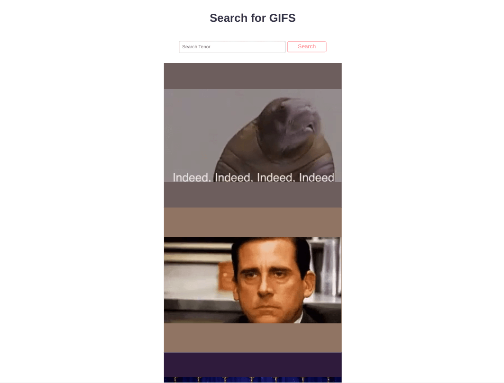

<h1 align="center">Gif Search</h1>

   Tutorial from  <a href="https://makeschool.org/mediabook/oa/tutorials/gif-search-app-ynu/your-node-environment/" target="_blank">makeschool.org</a>.

## Table of Contents

- [Overview](#overview)
  - [Built With](#built-with)
- [Features](#features)
- [Improvements](#improvements)
- [Useful Resources](#useful-resources)

## Overview

MakeSchool was a coding bootcamp that went under.  Most content was made free and I found this and decided to follow along.

To run, git clone and add a Tenor API Key.

### Built With

- Express
- Handlebars
- Tenorjs

## Features

Simple search to an API and displaying the results.  

## Improvements

- Handlebars has problems with prototype pollution.  
- Rework the fetching to tenor API.

### Resources

- npx express-generator --view=hbs ______ (project name) 

- [YouTube](https://www.youtube.com/watch?v=EjhVucMRMbM) - Set up express
- [Snyk](https://snyk.io/vuln/SNYK-JS-HBS-1566555) - hbs vulnerability
- [Github](https://securitylab.github.com/advisories/GHSL-2021-020-pillarjs-hbs/) - security advisory hbs
- [Stack Overflow](https://stackoverflow.com/questions/30051236/argument-passed-in-must-be-a-string-of-24-hex-characters-i-think-it-is) - warning hbs
- [NPM](https://www.npmjs.com/package/express-handlebars) - express handlebars
- [Stack Overflow](https://stackoverflow.com/questions/69959820/typeerror-exphbs-is-not-a-function)
- [Stack Overflow](https://stackoverflow.com/questions/15463199/how-to-set-custom-favicon-in-express) - favicon in express 
